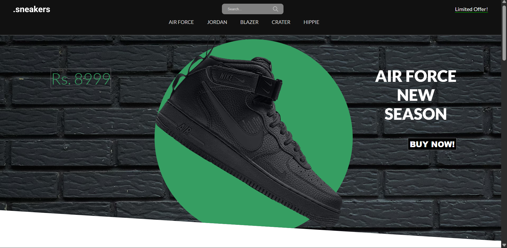
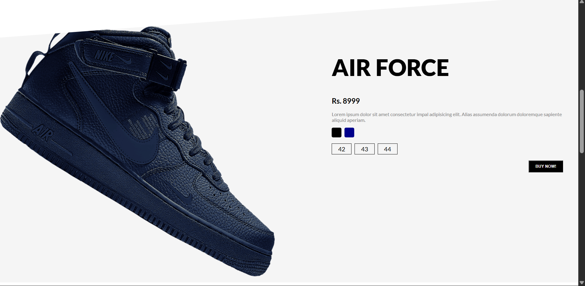
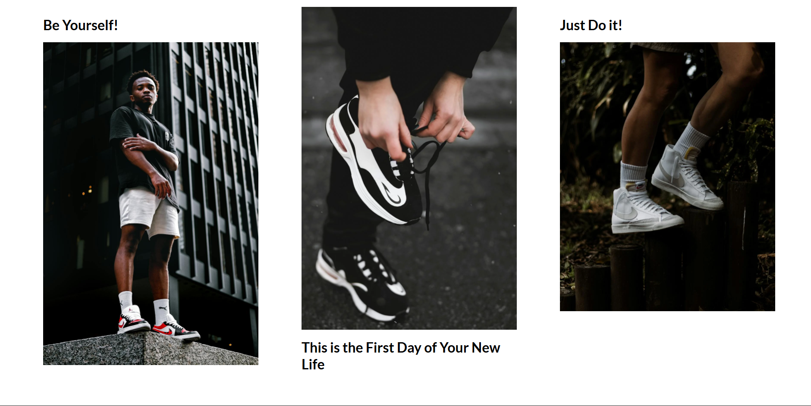

# 👟 Dotsneakers

A modern and responsive sneaker e-commerce website built using HTML, CSS, and JavaScript.

---

## 🚀 Overview

Dotsneakers is a front-end web project designed to showcase a stylish sneaker store interface. It focuses on clean UI design, responsiveness, and smooth user experience.

---

## ✨ Features

* 🛍️ Product showcase
* 📱 Fully responsive design
* 🎨 Modern UI/UX
* ⚡ Smooth navigation
* 🖼️ Image-based product display

---

## 🛠️ Tech Stack

* HTML5
* CSS3
* JavaScript

---

## 📂 Project Structure

Dotsneakers/
│── index.html
│── css/
│── js/
│── images/

---

## ▶️ How to Run

1. Clone the repository
2. Open `index.html` in your browser

---

## 📸 Screenshots

## 🔗 Live Demo

https://arani37.github.io/Dotsneakers.github.io/

---

## 📌 Future Improvements

* Add shopping cart functionality
* Backend integration
* User authentication

---

## 🙌 Author

Created by Arani
